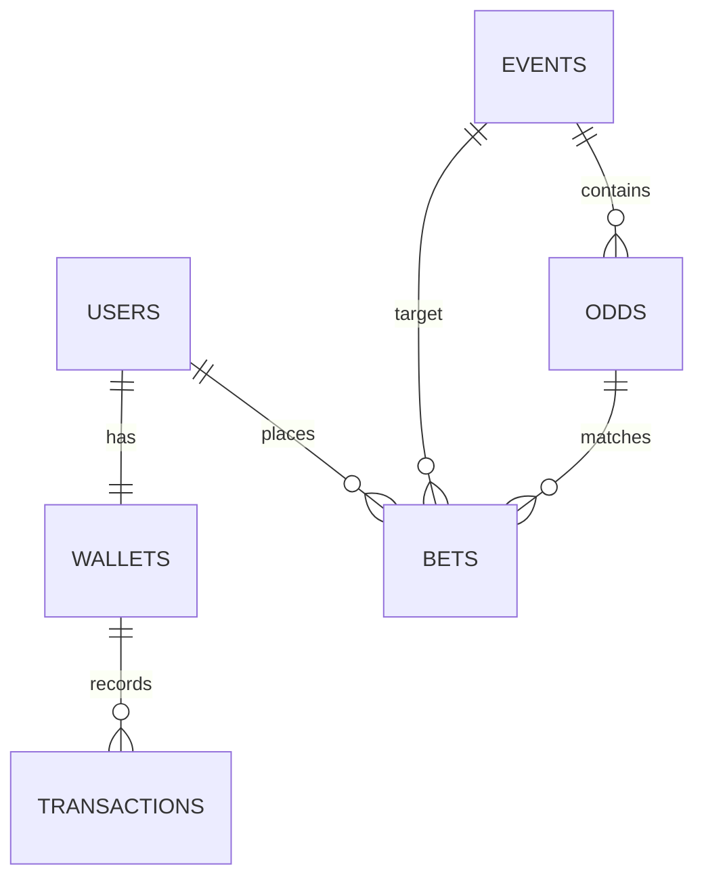
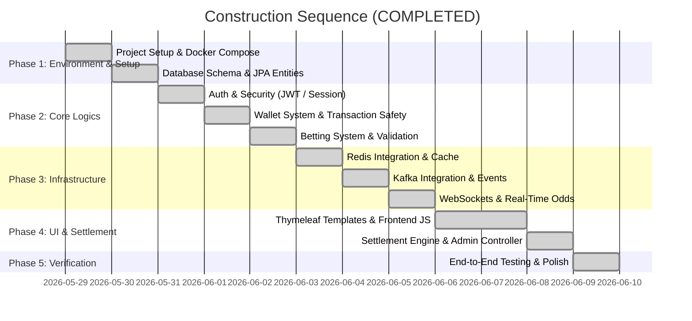

# Implementation Plan: Real-Time Betting Engine (Spring Boot + Thymeleaf)

This plan outlines the design, architecture, database schemas, messaging architecture, and step-by-step construction of a production-grade, highly concurrent sports betting application.

---

## 🏗️ Architecture Design & Flow

### 1. Database Schema
To handle high concurrency and financial transactions safely, we use PostgreSQL with explicit indexing, strict constraints, and **Optimistic Locking** on wallets and odds.



#### SQL Schema Details (`sql/schema.sql`)
- **`users`**:
  - `id` (UUID, Primary Key)
  - `username` (VARCHAR(50), Unique, Indexed)
  - `email` (VARCHAR(100), Unique)
  - `password` (VARCHAR(100))
  - `role` (VARCHAR(20), e.g., 'USER', 'ADMIN')
  - `created_at` (TIMESTAMP)
- **`wallets`**:
  - `id` (UUID, Primary Key)
  - `user_id` (UUID, Foreign Key, Unique, Indexed)
  - `balance` (NUMERIC(15,2), Check >= 0)
  - `currency` (VARCHAR(3), Default 'USD')
  - `version` (INT, Optimistic Lock Version)
- **`transactions`**:
  - `id` (UUID, Primary Key)
  - `wallet_id` (UUID, Foreign Key, Indexed)
  - `type` (VARCHAR(20), e.g., 'DEPOSIT', 'WITHDRAW', 'BET_PLACED', 'BET_SETTLED', 'BET_REFUNDED')
  - `amount` (NUMERIC(15,2))
  - `reference_id` (UUID, Nullable, e.g., Bet ID or external Payment ID)
  - `description` (TEXT)
  - `created_at` (TIMESTAMP)
- **`events`**:
  - `id` (UUID, Primary Key)
  - `sport` (VARCHAR(50), Indexed)
  - `home_team` (VARCHAR(100))
  - `away_team` (VARCHAR(100))
  - `home_score` (INT, Default 0)
  - `away_score` (INT, Default 0)
  - `status` (VARCHAR(20), e.g., 'SCHEDULED', 'LIVE', 'SUSPENDED', 'FINISHED', Indexed)
  - `start_time` (TIMESTAMP, Indexed)
  - `ended_at` (TIMESTAMP, Nullable)
- **`odds`**:
  - `id` (UUID, Primary Key)
  - `event_id` (UUID, Foreign Key, Indexed)
  - `market_name` (VARCHAR(50), e.g., '1X2', 'OVER_UNDER')
  - `selection_name` (VARCHAR(50), e.g., 'HOME_WIN', 'DRAW', 'AWAY_WIN')
  - `odds_value` (NUMERIC(6,2), Check > 1.0)
  - `status` (VARCHAR(20), e.g., 'ACTIVE', 'SUSPENDED')
  - `version` (INT, Optimistic Lock Version)
- **`bets`**:
  - `id` (UUID, Primary Key)
  - `user_id` (UUID, Foreign Key, Indexed)
  - `event_id` (UUID, Foreign Key, Indexed)
  - `odds_id` (UUID, Foreign Key)
  - `selection_name` (VARCHAR(50))
  - `odds_value` (NUMERIC(6,2))
  - `stake` (NUMERIC(15,2))
  - `potential_payout` (NUMERIC(15,2))
  - `status` (VARCHAR(20), e.g., 'PENDING', 'WON', 'LOST', 'VOIDED', Indexed)
  - `placed_at` (TIMESTAMP)
  - `settled_at` (TIMESTAMP, Nullable)

---

### 2. Kafka Event Flow
Kafka serves as our asynchronous messaging backbone. It decouples high-throughput betting operations and settlements from the main user-facing Web API threads.

```
[Web API: Bet Placement]
       │
       ▼ (Database Transaction: Deduct Wallet + Save PENDING Bet)
[Publish to Kafka: "bet-placed" Topic]
       │
       ├────────────────────────────────────┐
       ▼                                    ▼
[Kafka Consumer: Risk Service]    [Kafka Consumer: Metrics/Audit]
```

```
[Admin Service: Settle Match]
       │
       ▼ (Database: Match status -> FINISHED)
[Publish to Kafka: "event-settlement" Topic]
       │
       ▼
[Kafka Consumer: Settlement Service]
       │
       ├─► Loop all bets for event -> Calculate win/loss
       ├─► Update bet status (WON/LOST)
       ├─► Credit winning wallets (+ Version increment)
       └─► Publish to Kafka: "bet-settled" Topic -> Alerts user via WebSocket
```

- **Topics**:
  - `odds-updates`: Emitted whenever odds change. Listened to by WebSocket service to push updates to client browsers.
  - `bet-placements`: Emitted when a bet is validated and locked in the database. Used for auditing, risk assessment, and tracking.
  - `bet-settlements`: Emitted when an event completes to trigger asynchronous bulk settlement calculations and wallet crediting.

---

### 3. Caching Architecture (Redis)
- **Odds Cache**: Read-heavy operations (e.g., fetching active matches and odds) will read from Redis first. Cache is updated on any odds change (`cache-aside` + `write-through` on odds-updates).
- **Wallet Buffer**: Current balance is cached in Redis for fast page-render checks. DB acts as transactional source-of-truth.
- **Session Store**: User sessions are persisted in Redis to support horizontal scalability.

---

### 4. WebSocket Real-Time Updates
- **Endpoint**: `/ws/odds`
- **Behavior**: Client connects on dashboard/events page. When an `odds-updates` event occurs, the WebSocket Handler broadcasts a JSON message containing the event ID, market name, selection, and new odds.
- **UI Animation**: When an update is received, the corresponding HTML elements blink:
  - **Green** for odds increase.
  - **Red** for odds decrease.
  - **Gray/Lock Icon** if odds are suspended.

---

## 🚦 REST API Endpoints

### Authentication & Users
- `POST /api/auth/register` (Register user)
- `POST /api/auth/login` (Login, returns JWT or sets session cookie)
- `POST /api/auth/logout` (Log out user)

### Sports Events
- `GET /api/events` (Fetch active and live events)
- `GET /api/events/{id}` (Fetch event details)

### Betting
- `POST /api/bets` (Place a bet. Body: `eventId`, `oddsId`, `selectionName`, `oddsValue`, `stake`)
- `GET /api/bets` (Fetch current user's bet history)

### Wallet
- `GET /api/wallet` (Fetch wallet balance and transaction history)
- `POST /api/wallet/deposit` (Deposit funds. Body: `amount`)
- `POST /api/wallet/withdraw` (Withdraw funds. Body: `amount`)

### Admin Panel (Role: ADMIN)
- `POST /api/admin/events` (Create sports event)
- `PUT /api/admin/events/{id}/odds` (Update odds value or status)
- `PUT /api/admin/events/{id}/score` (Update scores and match status)
- `POST /api/admin/events/{id}/settle` (Settle event and trigger bet settlements)

---

## 🌐 Thymeleaf UI Mockup & Pages
All pages will share a layout utilizing a dark-mode theme, sleek cards, glowing status tags, and smooth UI transition effects.

1. **`login.html` / `register.html`**: Sleek modern form with glassmorphism layout, animated validation errors.
2. **`dashboard.html` / `index.html`**: General overview of live events, quick bets, and account balance.
3. **`events.html`**: Main sportsbook interface. Includes WebSocket listeners. Odds boxes display flashing animations when prices fluctuate.
4. **`wallet.html`**: Interactive deposit/withdrawal form, visual transaction history with positive (green) and negative (red) indicators.
5. **`admin.html`**: Control room with quick action buttons to update scores, toggle odds suspension, and settle events.

---

## 🛠️ Step-by-Step Build Order (Day-by-Day Plan)



---

## 🏁 Final System Stabilization Details

### 1. Global View Navigation Injection
Implemented `GlobalModelAdvice` (a `@ControllerAdvice` bean) that intercepts all Thymeleaf view mappings and automatically injects the active user's `wallet` state. This prevents navigation bar template evaluation crashes on `/events` and `/bets` pages, avoiding code duplication across controllers.

### 2. Type-Safe Asynchronous Kafka Deserialization
Added custom typed `ConcurrentKafkaListenerContainerFactory` instances for `OddsUpdatedEvent`, `BetPlacedEvent`, and `BetSettledEvent`. This bypasses reliance on Kafka header type variables, ensuring complete immunity against Jackson `ClassCastException` and `deserialization` failures in background service threads.

### 3. Real-Time WebSocket & Security Filter Access
Successfully configured Spring Security filters to permit WebSocket connections (`/ws/**`), enabling seamless low-latency odds feeds and flashing highlight visuals to update client browsers without page refreshes.

---

## Verification Plan

### Automated Tests
- JUnit tests for `WalletService` concurrency (testing optimistic locking under race conditions).
- Integration tests using Testcontainers or locally running PostgreSQL for `BettingService`.

### Manual Verification
- Launch the application via Docker Compose.
- Connect multiple browser tabs, make odds changes from the admin page, and observe WebSocket updates (green/red flash) on the user sportsbook page.
- Test double-spending in the wallet by executing concurrent requests.
